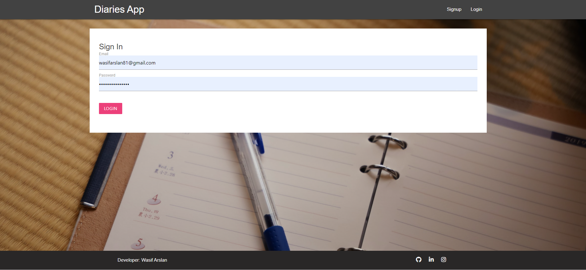
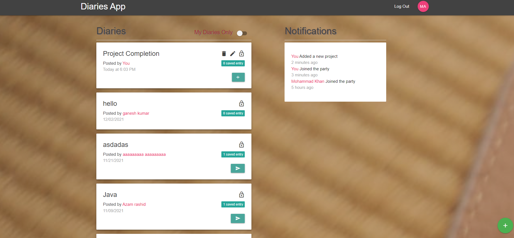
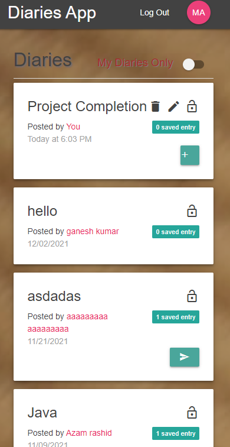

# :closed_book: Diaries Manager App

### _Diaries Manager Applciation, where Users can add and store "Public" and "Private" Diaries, and View each other's public diaries !!_

## Interface

## Mobile Interface

## Run Locally

- Run this command `git clone https://github.com/muhammadwasifarslan/diary-app.git`
- You are now in the dev environment and you can play around

## Features

- SignIn/SignUp Authentication
- Create and Update Diaries
- Create and Update Entries
- Delete diaries and entries
- View other User's "Public" Diaries
- Create Public and Private Diaries
- - Public: Everyone can view
- - Private: Only you can view
- Accessibility Optimized
- Mobile Responsive
- Open Source (Tweak it and use it) :)

## Tech Stack

- HTML5
- CSS3
- ES+6
- Materialize Css
- ReactJs
- Redux, Redux Thunk
- Firebase Auth (Authentication)
- Firebase Firestore (Database)
- Firebase (Hosting)
- Moment (Date Formatting)
- React-spinners (loaders)
- SweetAlerts (Alerts)
